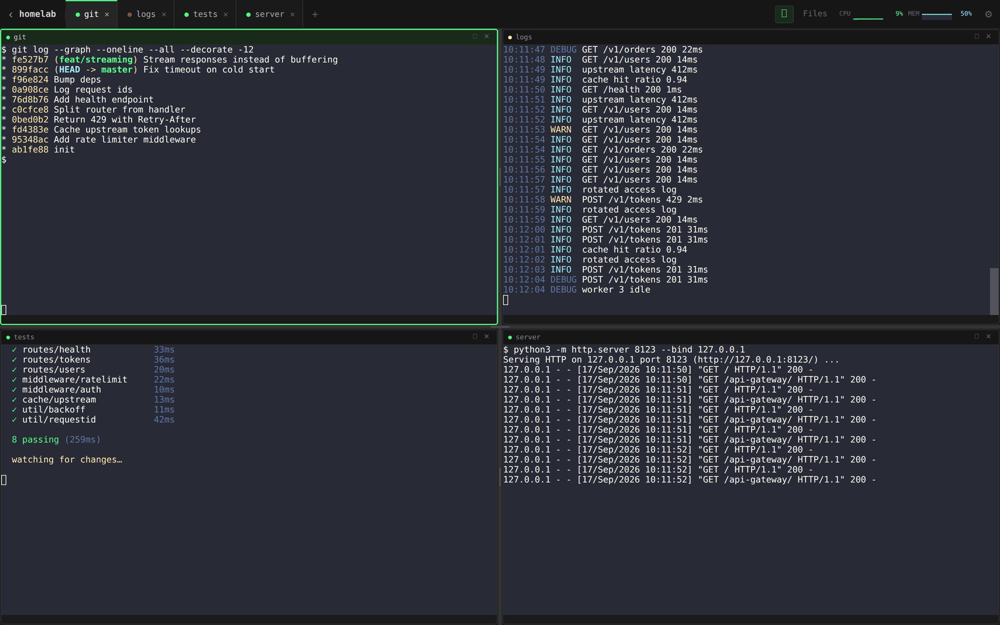

# tty

A self-hosted web terminal. Open a browser on your phone or laptop and get a full terminal — with persistent sessions that survive disconnects, organized into projects with multiple named tabs.



---

## Why tty

Most web terminals expose a single shell and call it done. tty is built around the workflow of running long-lived processes — AI agents, builds, log tails — and checking in on them from wherever you are.

- **Sessions persist** — tmux keeps everything running when you close the tab or lose your connection. Come back and pick up where you left off.
- **Organized workspaces** — group sessions into projects (e.g. a "homelab" project with tabs for "claude", "logs", "docker"). Activity indicators show which tabs have new output without you having to click through them.
- **Grid mode** — on desktop, view all sessions at once in a resizable grid. Drag dividers to resize, click to focus, maximize button to go full-screen.
- **Works on mobile** — touch scrolling, momentum, readable on small screens.
- **File browser** — upload and download files without needing scp or sftp.
- **No cloud, no telemetry** — runs on your own machine. Single password authentication, nothing else required.

---

## How it works

**Projects** group related terminals. Each project has one or more **sessions** — each session is a persistent tmux window that keeps running in the background. The workspace shows all sessions for the active project as tabs, with a dot indicator:

- 🟡 pulsing — session is producing output right now
- 🟠 static — output arrived while you were on another tab
- 🟢 steady — idle

Sessions are local shells or SSH connections to remote servers. They survive browser closes, network drops, and server restarts (local sessions are recovered automatically on boot).

---

## Requirements

- Node.js 18+
- tmux

---

## Quick start

```bash
git clone https://github.com/docnavy11/tty
cd tty
npm install
npm run build
node server/dist/index.js
```

Open http://localhost:3000

Create a project, add a session, open a terminal.

---

## Configuration

All configuration is via environment variables:

| Variable | Default | Description |
|----------|---------|-------------|
| `PORT` | `3000` | HTTP port |
| `HOST` | `0.0.0.0` | Bind address |
| `DATA_DIR` | `./data` | SQLite database and persistent data |
| `CLIENT_DIST` | `./client/dist` | Built frontend assets |
| `AUTH_TOKEN` | _(unset)_ | Password to protect the app. If unset, no auth. |

---

## Authentication

By default the app is open. Set `AUTH_TOKEN` to require a password:

```bash
AUTH_TOKEN=yourpassword node server/dist/index.js
```

Anyone visiting will be prompted for the password. The session is stored in a signed cookie.

**Always run behind HTTPS in production.** Without it, the password and all terminal I/O are transmitted in plaintext. See the [Reverse proxy](#reverse-proxy-and-https) section.

---

## Deploy with systemd

```bash
# Build
npm install && npm run build

# Install
sudo mkdir -p /opt/tty
sudo cp -r server/dist server/node_modules client/dist /opt/tty/
sudo cp tty.service /etc/systemd/system/tty@.service
```

Edit the service file to set your password and adjust the port if needed:

```bash
sudo nano /etc/systemd/system/tty@.service
```

Start it (replace `youruser` with the user you want sessions to run as):

```bash
sudo systemctl daemon-reload
sudo systemctl enable --now tty@youruser
```

```bash
# Useful commands
journalctl -u tty@youruser -f
sudo systemctl restart tty@youruser
```

### Updating

```bash
git pull && npm install && npm run build
sudo cp -r server/dist server/node_modules client/dist /opt/tty/
sudo systemctl restart tty@youruser
```

---

## Deploy with Docker

```bash
docker compose up -d
```

To set a password, add `AUTH_TOKEN=yourpassword` to the `environment` section of `docker-compose.yml`.

To give the container access to your SSH keys for connecting to remote servers, mount them into the container's home directory:

```yaml
volumes:
  - ./data:/app/data
  - ~/.ssh:/home/tty/.ssh:ro
```

---

## Reverse proxy and HTTPS

Always put tty behind a reverse proxy in production. The proxy handles TLS; tty stays on localhost.

In the service file, set `HOST=127.0.0.1` so tty isn't reachable directly:

```
Environment=HOST=127.0.0.1
Environment=PORT=3000
```

### Caddy (recommended)

Caddy handles certificates and renewal automatically. Create `/etc/caddy/Caddyfile`:

```
tty.example.com {
    reverse_proxy localhost:3000
}
```

```bash
sudo systemctl reload caddy
```

Done — Caddy provisions a Let's Encrypt certificate and handles HTTP→HTTPS redirects.

### nginx

```nginx
server {
    listen 80;
    server_name tty.example.com;
    return 301 https://$host$request_uri;
}

server {
    listen 443 ssl;
    server_name tty.example.com;

    ssl_certificate     /etc/letsencrypt/live/tty.example.com/fullchain.pem;
    ssl_certificate_key /etc/letsencrypt/live/tty.example.com/privkey.pem;

    location / {
        proxy_pass http://127.0.0.1:3000;

        # WebSocket support
        proxy_http_version 1.1;
        proxy_set_header Upgrade $http_upgrade;
        proxy_set_header Connection "upgrade";

        proxy_set_header Host $host;
        proxy_set_header X-Real-IP $remote_addr;

        # Keep terminal WebSockets alive through idle periods
        proxy_read_timeout 3600s;
        proxy_send_timeout 3600s;
    }
}
```

Get a certificate with Certbot before enabling the `443` block:

```bash
sudo certbot certonly --nginx -d tty.example.com
sudo nginx -s reload
```

---

## Security

- Set `AUTH_TOKEN` and run behind HTTPS
- The file browser exposes the home directory of the user running the server — use a dedicated low-privilege user
- SSH passwords are stored in the local SQLite database; protect `DATA_DIR`
- The Docker image runs as a non-root user (`uid 1001`)

---

## Tech stack

- **Server**: Node.js, Fastify, node-pty, ssh2, better-sqlite3
- **Client**: React, xterm.js, Vite
- **Sessions**: tmux (local) / ssh2 shell channels (remote)

---

## License

MIT
